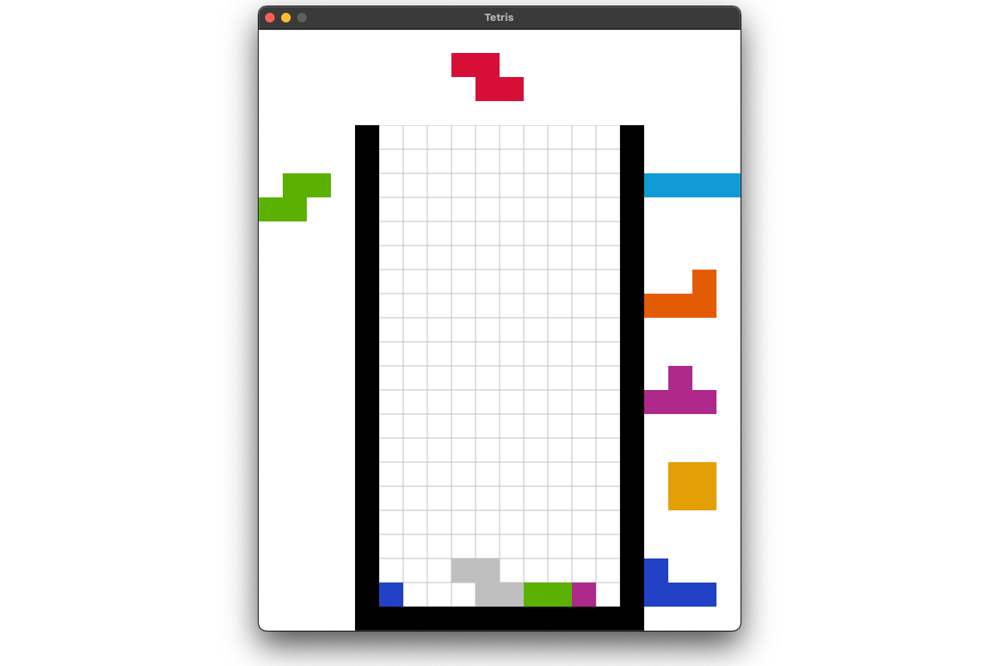

# tetris-ai

Exploring various ways to create bots that play tetris, written in Rust.

List of packages (last updated 2025-03-11)

- Core
  - `libtetris` - Optimized tetris game model, move generation, and AI interface
- GUI
  - `sdl-gui` - Simple tetris GUI written using SDL2
  - `web-wasm` - Compile tetris bots to WASM to run in the browser
  - `web-ui` - Browser interface to demo the various tetris bots (See live version at https://thesilican.com/tetris)
- Bots
  - `tree-bot` - Performs a dfs tree search on the game state to find the optimal move, guided by simple heuristics
  - `pc-finder` - Finds [perfect clear](https://harddrop.com/wiki/Perfect_clear) setups

You may need to install git lfs to clone this repo properly.
